# Dokumentasi UML Lengkap - CV Banbuk Store

Dokumen ini berisi spesifikasi UML (Unified Modeling Language) lengkap untuk sistem **CV Banbuk Store** (Virtual Product Gallery Web3). Semua diagram di bawah ini didefinisikan menggunakan format **Mermaid** sehingga dapat langsung dirender secara visual di GitHub, editor markdown modern, atau previewer Mermaid.

---

## 1. Use Case Diagram

Diagram Use Case menggambarkan interaksi antara aktor (pengguna manusia dan sistem eksternal) dengan use case (fitur) yang disediakan oleh sistem CV Banbuk Store. Diagram diatur secara horizontal (Left-to-Right) dengan pengelompokan modul sistem yang terorganisir.

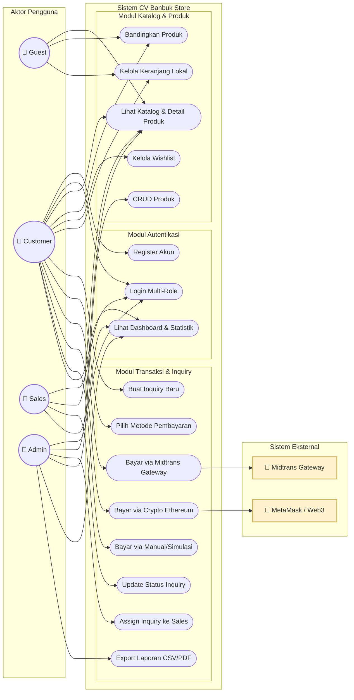
```mermaid
flowchart LR
    %% Aktor Pengguna (Kiri)
    subgraph Aktor ["Aktor Pengguna"]
        Guest((👥 Guest))
        Customer((👤 Customer))
        Sales((👤 Sales))
        Admin((👤 Admin))
    end

    %% Batas Sistem (Tengah)
    subgraph System ["Sistem CV Banbuk Store"]
        subgraph Auth ["Modul Autentikasi"]
            UC1([Register Akun])
            UC2([Login Multi-Role])
            UC15([Lihat Dashboard & Statistik])
        end

        subgraph Catalog ["Modul Katalog & Produk"]
            UC3([Lihat Katalog & Detail Produk])
            UC4([Bandingkan Produk])
            UC5([Kelola Wishlist])
            UC6([Kelola Keranjang Lokal])
            UC10([CRUD Produk])
        end

        subgraph Transaction ["Modul Transaksi & Inquiry"]
            UC7([Buat Inquiry Baru])
            UC8([Assign Inquiry ke Sales])
            UC9([Update Status Inquiry])
            UC11([Pilih Metode Pembayaran])
            UC12([Bayar via Midtrans Gateway])
            UC13([Bayar via Crypto Ethereum])
            UC14([Bayar via Manual/Simulasi])
            UC16([Export Laporan CSV/PDF])
        end
    end

    %% Sistem Eksternal (Kanan)
    subgraph External ["Sistem Eksternal"]
        Midtrans[🔌 Midtrans Gateway]
        MetaMask[🦊 MetaMask / Web3]
    end

    %% Relasi Aktor Guest
    Guest --> UC3
    Guest --> UC4
    Guest --> UC6

    %% Relasi Aktor Customer
    Customer --> UC1
    Customer --> UC2
    Customer --> UC3
    Customer --> UC4
    Customer --> UC5
    Customer --> UC6
    Customer --> UC7
    Customer --> UC11
    Customer --> UC12
    Customer --> UC13
    Customer --> UC14
    Customer --> UC15

    %% Relasi Aktor Sales
    Sales --> UC2
    Sales --> UC3
    Sales --> UC9
    Sales --> UC15

    %% Relasi Aktor Admin
    Admin --> UC2
    Admin --> UC3
    Admin --> UC8
    Admin --> UC10
    Admin --> UC15
    Admin --> UC16

    %% Relasi Sistem Eksternal
    UC12 --> Midtrans
    UC13 --> MetaMask

    %% Styling Nodes
    style Guest fill:#ececff,stroke:#9370db,stroke-width:2px
    style Customer fill:#ececff,stroke:#9370db,stroke-width:2px
    style Sales fill:#ececff,stroke:#9370db,stroke-width:2px
    style Admin fill:#ececff,stroke:#9370db,stroke-width:2px
    style Midtrans fill:#fff2cc,stroke:#d6b656,stroke-width:2px
    style MetaMask fill:#fff2cc,stroke:#d6b656,stroke-width:2px
```

### Deskripsi Aktor & Hak Akses
1. **Guest**: Pengguna yang belum login. Hanya dapat mencari, melihat, membandingkan produk, dan memasukkan produk ke keranjang lokal (`localStorage`).
2. **Customer**: Pengguna terdaftar (pembeli). Memiliki akses ke fitur transaksi (wishlist, checkout, inquiry, riwayat pembelian, pembayaran).
3. **Sales**: Staf penjualan. Bertanggung jawab memproses inquiry yang ditugaskan kepadanya, menghubungi customer via WhatsApp, dan memperbarui status inquiry.
4. **Admin**: Pengelola sistem. Bertanggung jawab mengelola produk (CRUD), memantau statistik, menugaskan inquiry ke sales, melihat user, dan mengunduh laporan.
5. **Midtrans (Sistem Eksternal)**: Gerbang pembayaran gateway untuk pemrosesan kartu/e-wallet/QRIS.
6. **MetaMask / Ethereum Network (Sistem Eksternal)**: Wallet dan blockchain network untuk pemrosesan transaksi crypto on-chain.

---

## 2. Class Diagram

Diagram kelas menunjukkan struktur statis sistem dengan mendefinisikan kelas-kelas entitas database, controller/API routes, dan integrasi eksternal beserta relasi dan operasinya.

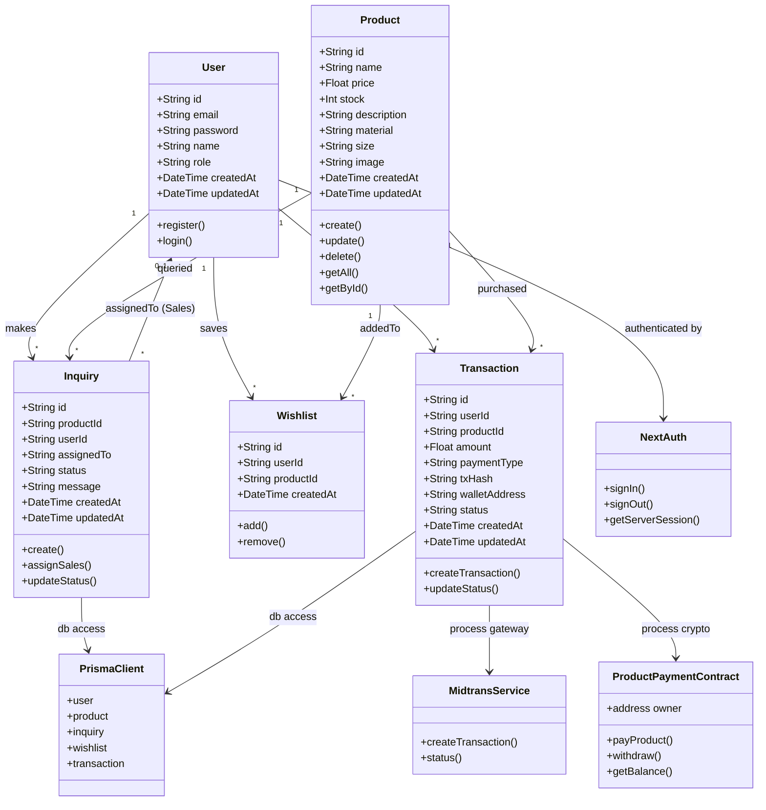
```mermaid
classDiagram
    class User {
        +String id
        +String email
        +String password
        +String name
        +String role
        +DateTime createdAt
        +DateTime updatedAt
        +register()
        +login()
    }
    class Product {
        +String id
        +String name
        +Float price
        +Int stock
        +String description
        +String material
        +String size
        +String image
        +DateTime createdAt
        +DateTime updatedAt
        +create()
        +update()
        +delete()
        +getAll()
        +getById()
    }
    class Inquiry {
        +String id
        +String productId
        +String userId
        +String assignedTo
        +String status
        +String message
        +DateTime createdAt
        +DateTime updatedAt
        +create()
        +assignSales()
        +updateStatus()
    }
    class Wishlist {
        +String id
        +String userId
        +String productId
        +DateTime createdAt
        +add()
        +remove()
    }
    class Transaction {
        +String id
        +String userId
        +String productId
        +Float amount
        +String paymentType
        +String txHash
        +String walletAddress
        +String status
        +DateTime createdAt
        +DateTime updatedAt
        +createTransaction()
        +updateStatus()
    }

    class NextAuth {
        +signIn()
        +signOut()
        +getServerSession()
    }

    class PrismaClient {
        +user
        +product
        +inquiry
        +wishlist
        +transaction
    }

    class MidtransService {
        +createTransaction()
        +status()
    }

    class ProductPaymentContract {
        +address owner
        +payProduct()
        +withdraw()
        +getBalance()
    }

    User "1" --> "*" Inquiry : makes
    User "1" --> "*" Wishlist : saves
    User "1" --> "*" Transaction : pays
    Inquiry "*" --> "0..1" User : assignedTo (Sales)
    
    Product "1" --> "*" Inquiry : queried
    Product "1" --> "*" Wishlist : addedTo
    Product "1" --> "*" Transaction : purchased
    
    Inquiry --> PrismaClient : db access
    Transaction --> PrismaClient : db access
    User --> NextAuth : authenticated by
    
    Transaction --> MidtransService : process gateway
    Transaction --> ProductPaymentContract : process crypto
```

---

## 3. Sequence Diagram - Registrasi Customer

Alur registrasi akun pembeli secara mandiri melalui form publik. Pendaftaran default menghasilkan akun dengan role `CUSTOMER`.

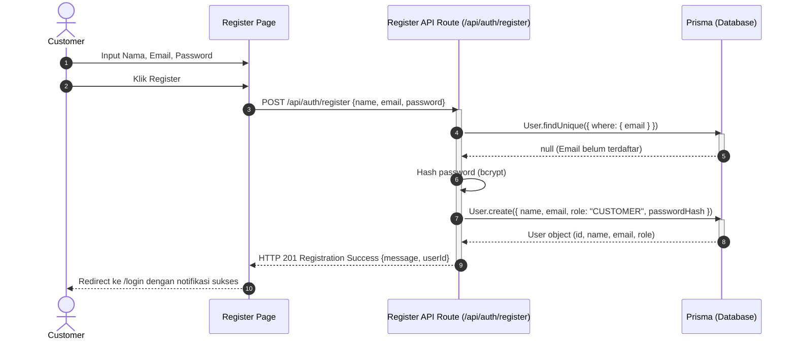
```mermaid
sequenceDiagram
    autonumber
    actor Customer
    participant Frontend as Register Page
    participant API as Register API Route (/api/auth/register)
    participant DB as Prisma (Database)
    
    Customer->>Frontend: Input Nama, Email, Password
    Customer->>Frontend: Klik Register
    Frontend->>API: POST /api/auth/register {name, email, password}
    activate API
    API->>DB: User.findUnique({ where: { email } })
    activate DB
    DB-->>API: null (Email belum terdaftar)
    deactivate DB
    API->>API: Hash password (bcrypt)
    API->>DB: User.create({ name, email, role: "CUSTOMER", passwordHash })
    activate DB
    DB-->>API: User object (id, name, email, role)
    deactivate DB
    API-->>Frontend: HTTP 201 Registration Success {message, userId}
    deactivate API
    Frontend-->>Customer: Redirect ke /login dengan notifikasi sukses
```

---

## 4. Sequence Diagram - Login Multi-Role

Alur masuk ke aplikasi menggunakan NextAuth dengan pencocokan kredensial yang tersimpan di database.

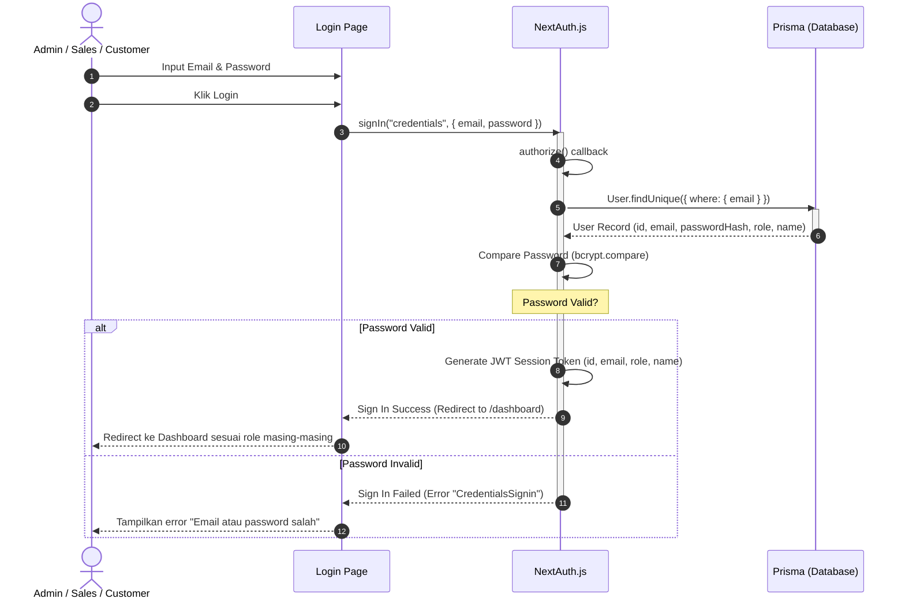
```mermaid
sequenceDiagram
    autonumber
    actor User as Admin / Sales / Customer
    participant UI as Login Page
    participant NextAuth as NextAuth.js
    participant DB as Prisma (Database)
    
    User->>UI: Input Email & Password
    User->>UI: Klik Login
    UI->>NextAuth: signIn("credentials", { email, password })
    activate NextAuth
    NextAuth->>NextAuth: authorize() callback
    NextAuth->>DB: User.findUnique({ where: { email } })
    activate DB
    DB-->>NextAuth: User Record (id, email, passwordHash, role, name)
    deactivate DB
    NextAuth->>NextAuth: Compare Password (bcrypt.compare)
    Note over NextAuth: Password Valid?
    alt Password Valid
        NextAuth->>NextAuth: Generate JWT Session Token (id, email, role, name)
        NextAuth-->>UI: Sign In Success (Redirect to /dashboard)
        UI-->>User: Redirect ke Dashboard sesuai role masing-masing
    else Password Invalid
        NextAuth-->>UI: Sign In Failed (Error "CredentialsSignin")
        deactivate NextAuth
        UI-->>User: Tampilkan error "Email atau password salah"
    end
```

---

## 5. Sequence Diagram - Manajemen Inquiry

Proses lengkap dari pembuatan inquiry oleh customer, penugasan sales oleh admin, hingga tindak lanjut dan penutupan inquiry oleh sales.

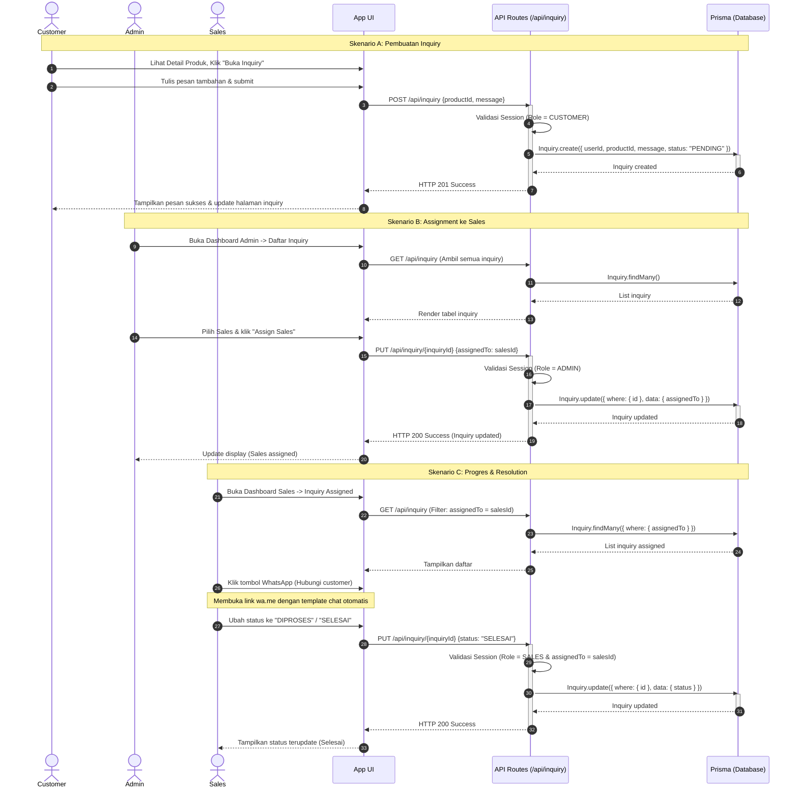
```mermaid
sequenceDiagram
    autonumber
    actor Customer
    actor Admin
    actor Sales
    participant Frontend as App UI
    participant API as API Routes (/api/inquiry)
    participant DB as Prisma (Database)

    %% Skenario A: Pembuatan Inquiry oleh Customer
    Note over Customer, DB: Skenario A: Pembuatan Inquiry
    Customer->>Frontend: Lihat Detail Produk, Klik "Buka Inquiry"
    Customer->>Frontend: Tulis pesan tambahan & submit
    Frontend->>API: POST /api/inquiry {productId, message}
    activate API
    API->>API: Validasi Session (Role = CUSTOMER)
    API->>DB: Inquiry.create({ userId, productId, message, status: "PENDING" })
    activate DB
    DB-->>API: Inquiry created
    deactivate DB
    API-->>Frontend: HTTP 201 Success
    deactivate API
    Frontend-->>Customer: Tampilkan pesan sukses & update halaman inquiry

    %% Skenario B: Assignment oleh Admin
    Note over Admin, DB: Skenario B: Assignment ke Sales
    Admin->>Frontend: Buka Dashboard Admin -> Daftar Inquiry
    Frontend->>API: GET /api/inquiry (Ambil semua inquiry)
    API->>DB: Inquiry.findMany()
    DB-->>API: List inquiry
    API-->>Frontend: Render tabel inquiry
    Admin->>Frontend: Pilih Sales & klik "Assign Sales"
    Frontend->>API: PUT /api/inquiry/{inquiryId} {assignedTo: salesId}
    activate API
    API->>API: Validasi Session (Role = ADMIN)
    API->>DB: Inquiry.update({ where: { id }, data: { assignedTo } })
    activate DB
    DB-->>API: Inquiry updated
    deactivate DB
    API-->>Frontend: HTTP 200 Success (Inquiry updated)
    deactivate API
    Frontend-->>Admin: Update display (Sales assigned)

    %% Skenario C: Progres & Resolution oleh Sales
    Note over Sales, DB: Skenario C: Progres & Resolution
    Sales->>Frontend: Buka Dashboard Sales -> Inquiry Assigned
    Frontend->>API: GET /api/inquiry (Filter: assignedTo = salesId)
    API->>DB: Inquiry.findMany({ where: { assignedTo } })
    DB-->>API: List inquiry assigned
    API-->>Frontend: Tampilkan daftar
    Sales->>Frontend: Klik tombol WhatsApp (Hubungi customer)
    Note over Sales, Frontend: Membuka link wa.me dengan template chat otomatis
    Sales->>Frontend: Ubah status ke "DIPROSES" / "SELESAI"
    Frontend->>API: PUT /api/inquiry/{inquiryId} {status: "SELESAI"}
    activate API
    API->>API: Validasi Session (Role = SALES & assignedTo = salesId)
    API->>DB: Inquiry.update({ where: { id }, data: { status } })
    activate DB
    DB-->>API: Inquiry updated
    deactivate DB
    API-->>Frontend: HTTP 200 Success
    deactivate API
    Frontend-->>Sales: Tampilkan status terupdate (Selesai)
```

---

## 6. Sequence Diagram - Manajemen Wishlist

Proses menambahkan produk ke daftar favorit customer dan menghapusnya kembali.

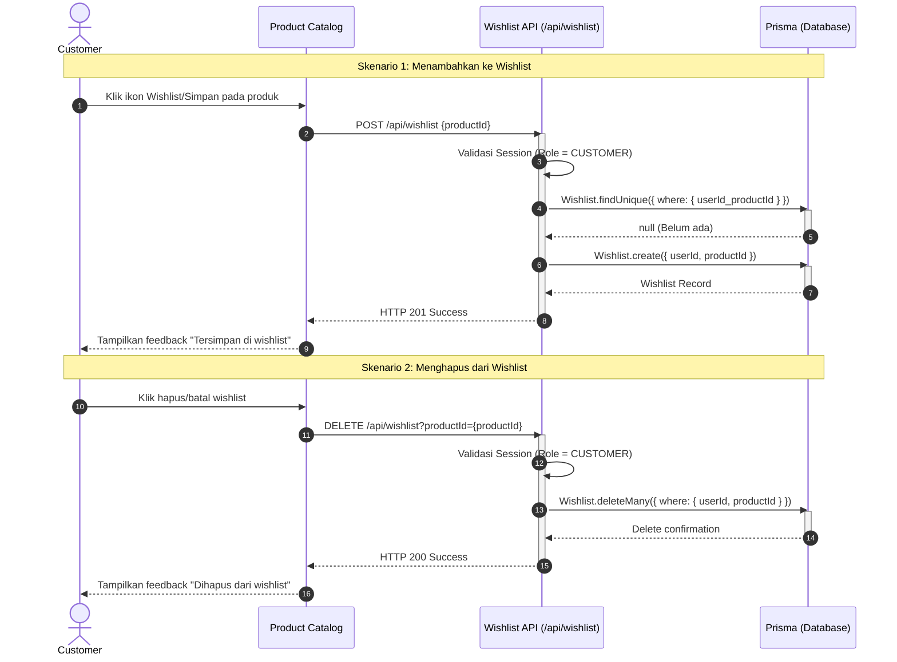
```mermaid
sequenceDiagram
    autonumber
    actor Customer
    participant UI as Product Catalog
    participant API as Wishlist API (/api/wishlist)
    participant DB as Prisma (Database)
    
    %% Tambah Wishlist
    Note over Customer, DB: Skenario 1: Menambahkan ke Wishlist
    Customer->>UI: Klik ikon Wishlist/Simpan pada produk
    UI->>API: POST /api/wishlist {productId}
    activate API
    API->>API: Validasi Session (Role = CUSTOMER)
    API->>DB: Wishlist.findUnique({ where: { userId_productId } })
    activate DB
    DB-->>API: null (Belum ada)
    deactivate DB
    API->>DB: Wishlist.create({ userId, productId })
    activate DB
    DB-->>API: Wishlist Record
    deactivate DB
    API-->>UI: HTTP 201 Success
    deactivate API
    UI-->>Customer: Tampilkan feedback "Tersimpan di wishlist"
    
    %% Hapus Wishlist
    Note over Customer, DB: Skenario 2: Menghapus dari Wishlist
    Customer->>UI: Klik hapus/batal wishlist
    UI->>API: DELETE /api/wishlist?productId={productId}
    activate API
    API->>API: Validasi Session (Role = CUSTOMER)
    API->>DB: Wishlist.deleteMany({ where: { userId, productId } })
    activate DB
    DB-->>API: Delete confirmation
    deactivate DB
    API-->>UI: HTTP 200 Success
    deactivate API
    UI-->>Customer: Tampilkan feedback "Dihapus dari wishlist"
```

---

## 7. Sequence Diagram - Pembayaran Midtrans Gateway

Alur lengkap pembayaran produk oleh customer menggunakan gateway Midtrans Snap hingga proses callback / webhook pemberitahuan status transaksi.

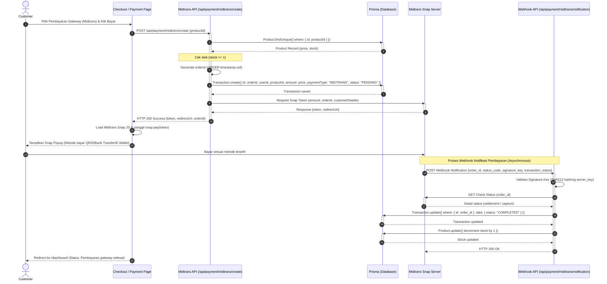
```mermaid
sequenceDiagram
    autonumber
    actor Customer
    participant UI as Checkout / Payment Page
    participant API as Midtrans API (/api/payment/midtrans/create)
    participant DB as Prisma (Database)
    participant Midtrans as Midtrans Snap Server
    participant Webhook as Webhook API (/api/payment/midtrans/notification)
    
    Customer->>UI: Pilih Pembayaran Gateway (Midtrans) & Klik Bayar
    UI->>API: POST /api/payment/midtrans/create {productId}
    activate API
    API->>DB: Product.findUnique({ where: { id: productId } })
    activate DB
    DB-->>API: Product Record (price, stock)
    deactivate DB
    Note over API: Cek stok (stock >= 1)
    API->>API: Generate orderId (ORDER-timestamp-uid)
    API->>DB: Transaction.create({ id: orderId, userId, productId, amount: price, paymentType: "MIDTRANS", status: "PENDING" })
    activate DB
    DB-->>API: Transaction saved
    deactivate DB
    API->>Midtrans: Request Snap Token (amount, orderId, customerDetails)
    activate Midtrans
    Midtrans-->>API: Response {token, redirectUrl}
    deactivate Midtrans
    API-->>UI: HTTP 200 Success {token, redirectUrl, orderId}
    deactivate API
    
    UI->>UI: Load Midtrans Snap JS & panggil snap.pay(token)
    UI-->>Customer: Tampilkan Snap Popup (Metode bayar QRIS/Bank Transfer/E-Wallet)
    Customer->>Midtrans: Bayar sesuai metode terpilih
    
    %% Webhook Notification
    Note over Midtrans, Webhook: Proses Webhook Notifikasi Pembayaran (Asynchronous)
    Midtrans->>Webhook: POST Webhook Notification {order_id, status_code, signature_key, transaction_status}
    activate Webhook
    Webhook->>Webhook: Validasi Signature Key (SHA512 hashing server_key)
    Webhook->>Midtrans: GET Check Status (order_id)
    activate Midtrans
    Midtrans-->>Webhook: Detail status (settlement / capture)
    deactivate Midtrans
    Webhook->>DB: Transaction.update({ where: { id: order_id }, data: { status: "COMPLETED" } })
    activate DB
    DB-->>Webhook: Transaction updated
    deactivate DB
    Webhook->>DB: Product.update({ decrement stock by 1 })
    activate DB
    DB-->>Webhook: Stock updated
    deactivate DB
    Webhook-->>Midtrans: HTTP 200 OK
    deactivate Webhook
    
    %% Customer redirect
    UI-->>Customer: Redirect ke /dashboard (Status: Pembayaran gateway selesai)
```

---

## 8. Sequence Diagram - Pembayaran Crypto Ethereum

Proses checkout menggunakan integrasi web3, interaksi MetaMask client-side dengan smart contract Solidity untuk pengiriman ETH, dan pencatatan on-chain.

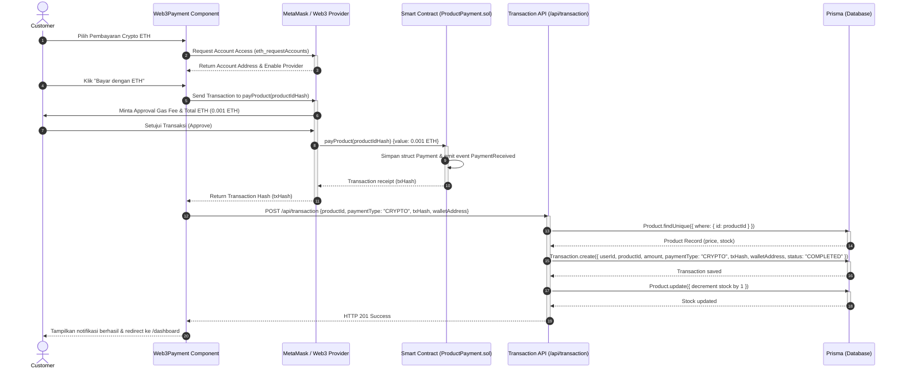
```mermaid
sequenceDiagram
    autonumber
    actor Customer
    participant UI as Web3Payment Component
    participant MetaMask as MetaMask / Web3 Provider
    participant Contract as Smart Contract (ProductPayment.sol)
    participant API as Transaction API (/api/transaction)
    participant DB as Prisma (Database)
    
    Customer->>UI: Pilih Pembayaran Crypto ETH
    UI->>MetaMask: Request Account Access (eth_requestAccounts)
    activate MetaMask
    MetaMask-->>UI: Return Account Address & Enable Provider
    deactivate MetaMask
    
    Customer->>UI: Klik "Bayar dengan ETH"
    UI->>MetaMask: Send Transaction to payProduct(productIdHash)
    activate MetaMask
    MetaMask->>Customer: Minta Approval Gas Fee & Total ETH (0.001 ETH)
    Customer->>MetaMask: Setujui Transaksi (Approve)
    MetaMask->>Contract: payProduct(productIdHash) {value: 0.001 ETH}
    activate Contract
    Contract->>Contract: Simpan struct Payment & emit event PaymentReceived
    Contract-->>MetaMask: Transaction receipt (txHash)
    deactivate Contract
    MetaMask-->>UI: Return Transaction Hash (txHash)
    deactivate MetaMask
    
    UI->>API: POST /api/transaction {productId, paymentType: "CRYPTO", txHash, walletAddress}
    activate API
    API->>DB: Product.findUnique({ where: { id: productId } })
    activate DB
    DB-->>API: Product Record (price, stock)
    deactivate DB
    API->>DB: Transaction.create({ userId, productId, amount, paymentType: "CRYPTO", txHash, walletAddress, status: "COMPLETED" })
    activate DB
    DB-->>API: Transaction saved
    deactivate DB
    API->>DB: Product.update({ decrement stock by 1 })
    activate DB
    DB-->>API: Stock updated
    deactivate DB
    API-->>UI: HTTP 201 Success
    deactivate API
    UI-->>Customer: Tampilkan notifikasi berhasil & redirect ke /dashboard
```

---

## 9. Activity Diagrams

Bagian ini memetakan alur aktivitas untuk setiap fitur utama di dalam sistem CV Banbuk Store.

### 9a. Activity Diagram - Registrasi & Login (Autentikasi)

Diagram ini menggambarkan alur pendaftaran user baru hingga proses penentuan dashboard setelah login sukses berdasarkan role.

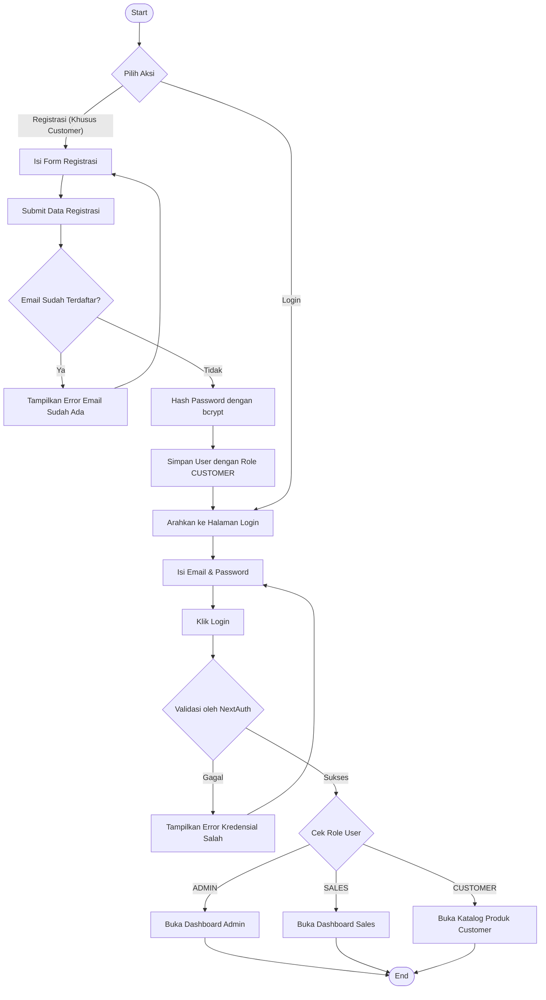
```mermaid
flowchart TD
    Start([Start]) --> Action{"Pilih Aksi"}
    Action -- "Registrasi (Khusus Customer)" --> RegForm[Isi Form Registrasi]
    RegForm --> RegSubmit[Submit Data Registrasi]
    RegSubmit --> CheckEmailExist{"Email Sudah Terdaftar?"}
    CheckEmailExist -- "Ya" --> ShowRegError[Tampilkan Error Email Sudah Ada]
    ShowRegError --> RegForm
    CheckEmailExist -- "Tidak" --> HashPassword[Hash Password dengan bcrypt]
    HashPassword --> SaveUser[Simpan User dengan Role CUSTOMER]
    SaveUser --> RedirectLogin[Arahkan ke Halaman Login]
    
    Action -- "Login" --> RedirectLogin
    RedirectLogin --> LoginForm[Isi Email & Password]
    LoginForm --> SubmitLogin[Klik Login]
    SubmitLogin --> AuthNextAuth{"Validasi oleh NextAuth"}
    AuthNextAuth -- "Gagal" --> ShowLoginError[Tampilkan Error Kredensial Salah]
    ShowLoginError --> LoginForm
    AuthNextAuth -- "Sukses" --> RoleCheck{"Cek Role User"}
    
    RoleCheck -- "ADMIN" --> AdminDash[Buka Dashboard Admin]
    RoleCheck -- "SALES" --> SalesDash[Buka Dashboard Sales]
    RoleCheck -- "CUSTOMER" --> CustCatalog[Buka Katalog Produk Customer]
    
    AdminDash --> Finish([End])
    SalesDash --> Finish
    CustCatalog --> Finish
```

### 9b. Activity Diagram - Manajemen Produk (CRUD oleh Admin)

Alur kelola produk oleh admin, dari menambah produk, mengubah spesifikasi, hingga menghapus item dari database.

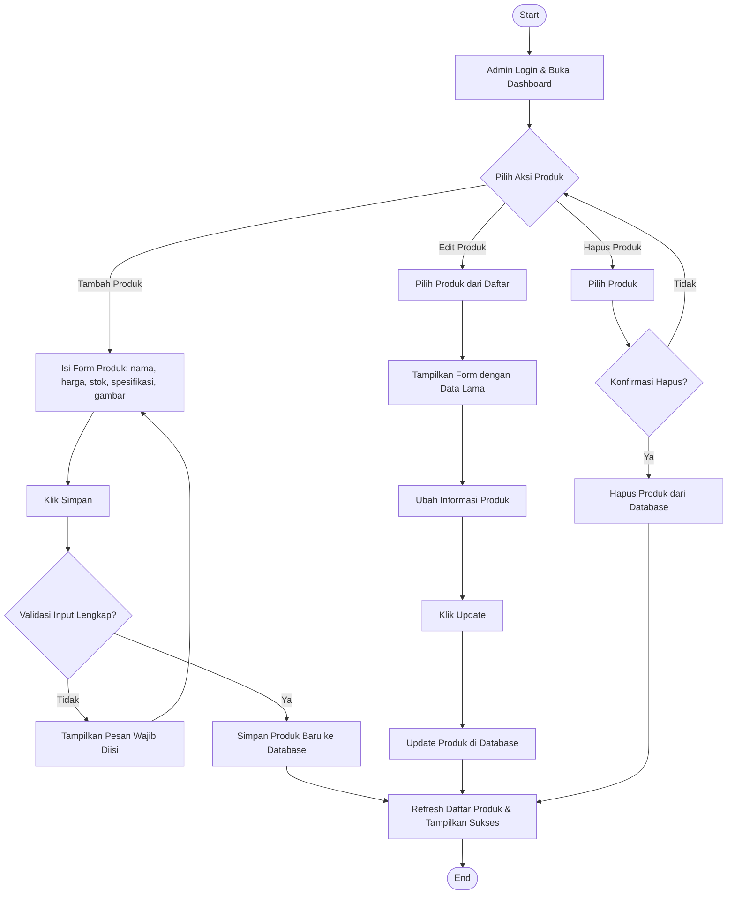
```mermaid
flowchart TD
    Start([Start]) --> LoginAdmin[Admin Login & Buka Dashboard]
    LoginAdmin --> ActionChoose{"Pilih Aksi Produk"}
    
    %% Create
    ActionChoose -- "Tambah Produk" --> InputForm[Isi Form Produk: nama, harga, stok, spesifikasi, gambar]
    InputForm --> SubmitForm[Klik Simpan]
    SubmitForm --> ValidateInput{"Validasi Input Lengkap?"}
    ValidateInput -- "Tidak" --> ShowInputError[Tampilkan Pesan Wajib Diisi]
    ShowInputError --> InputForm
    ValidateInput -- "Ya" --> DbInsert[Simpan Produk Baru ke Database]
    
    %% Update
    ActionChoose -- "Edit Produk" --> SelectProduct[Pilih Produk dari Daftar]
    SelectProduct --> LoadForm[Tampilkan Form dengan Data Lama]
    LoadForm --> EditInput[Ubah Informasi Produk]
    EditInput --> SubmitEdit[Klik Update]
    SubmitEdit --> DbUpdate[Update Produk di Database]
    
    %% Delete
    ActionChoose -- "Hapus Produk" --> DeleteProduct[Pilih Produk]
    DeleteProduct --> ConfirmDelete{"Konfirmasi Hapus?"}
    ConfirmDelete -- "Tidak" --> ActionChoose
    ConfirmDelete -- "Ya" --> DbDelete[Hapus Produk dari Database]
    
    DbInsert --> RefreshCatalog[Refresh Daftar Produk & Tampilkan Sukses]
    DbUpdate --> RefreshCatalog
    DbDelete --> RefreshCatalog
    RefreshCatalog --> Finish([End])
```

### 9c. Activity Diagram - Manajemen Inquiry (Customer, Admin, Sales)

Alur kolaboratif inquiry, mulai dari pembuatan inquiry oleh customer, penugasan oleh admin, hingga tindak lanjut dan penutupan status oleh sales.

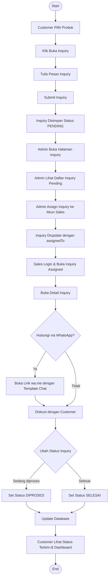
```mermaid
flowchart TD
    Start([Start]) --> CustBrowse[Customer Pilih Produk]
    CustBrowse --> ClickInquiry[Klik Buka Inquiry]
    ClickInquiry --> FillMsg[Tulis Pesan Inquiry]
    FillMsg --> SendInquiry[Submit Inquiry]
    SendInquiry --> DbSaveInquiry[Inquiry Disimpan Status PENDING]
    
    DbSaveInquiry --> AdminDash[Admin Buka Halaman Inquiry]
    AdminDash --> ViewList[Admin Lihat Daftar Inquiry Pending]
    ViewList --> AssignSales[Admin Assign Inquiry ke Akun Sales]
    AssignSales --> DbUpdateAssign[Inquiry Diupdate dengan assignedTo]
    
    DbUpdateAssign --> SalesLogin[Sales Login & Buka Inquiry Assigned]
    SalesLogin --> OpenDetails[Buka Detail Inquiry]
    OpenDetails --> WAContact{"Hubungi via WhatsApp?"}
    WAContact -- "Ya" --> OpenWA[Buka Link wa.me dengan Template Chat]
    OpenWA --> FollowUp[Diskusi dengan Customer]
    WAContact -- "Tidak" --> FollowUp
    
    FollowUp --> UpdateStatus{"Ubah Status Inquiry"}
    UpdateStatus -- "Sedang diproses" --> StatusProcess[Set Status DIPROSES]
    UpdateStatus -- "Selesai" --> StatusComplete[Set Status SELESAI]
    
    StatusProcess --> DbUpdateInquiry[Update Database]
    StatusComplete --> DbUpdateInquiry
    DbUpdateInquiry --> CustDash[Customer Lihat Status Terkini di Dashboard]
    CustDash --> Finish([End])
```

### 9d. Activity Diagram - Manajemen Wishlist (Customer)

Aktivitas customer untuk menyimpan produk favorit dan membatalkannya secara dinamis.

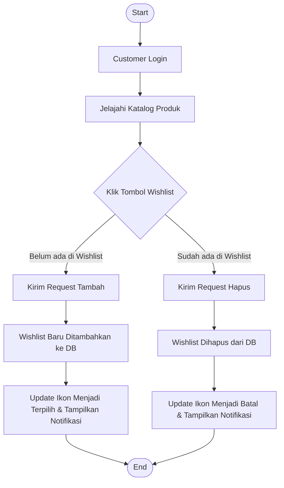
```mermaid
flowchart TD
    Start([Start]) --> CustLogin[Customer Login]
    CustLogin --> BrowseCatalog[Jelajahi Katalog Produk]
    BrowseCatalog --> ClickWish{"Klik Tombol Wishlist"}
    
    ClickWish -- "Belum ada di Wishlist" --> AddWish[Kirim Request Tambah]
    AddWish --> DbAdd[Wishlist Baru Ditambahkan ke DB]
    DbAdd --> UIAdded[Update Ikon Menjadi Terpilih & Tampilkan Notifikasi]
    
    ClickWish -- "Sudah ada di Wishlist" --> RemoveWish[Kirim Request Hapus]
    RemoveWish --> DbRemove[Wishlist Dihapus dari DB]
    DbRemove --> UIRemoved[Update Ikon Menjadi Batal & Tampilkan Notifikasi]
    
    UIAdded --> Finish([End])
    UIRemoved --> Finish
```

### 9e. Activity Diagram - Perbandingan (Compare) Produk

Alur saat pengguna memilih dan membandingkan spesifikasi dua produk secara berdampingan.

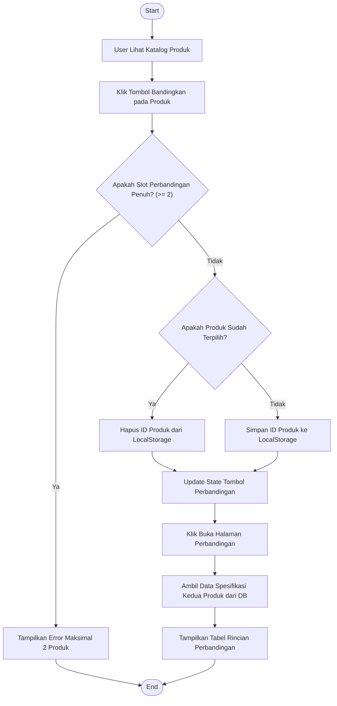
```mermaid
flowchart TD
    Start([Start]) --> BrowseCatalog[User Lihat Katalog Produk]
    BrowseCatalog --> ClickCompare[Klik Tombol Bandingkan pada Produk]
    ClickCompare --> CheckLimit{"Apakah Slot Perbandingan Penuh? (>= 2)"}
    
    CheckLimit -- "Ya" --> ShowError[Tampilkan Error Maksimal 2 Produk]
    ShowError --> Finish([End])
    
    CheckLimit -- "Tidak" --> ToggleSelection{"Apakah Produk Sudah Terpilih?"}
    ToggleSelection -- "Ya" --> RemoveCompare[Hapus ID Produk dari LocalStorage]
    RemoveCompare --> UISelectionUpdate[Update State Tombol Perbandingan]
    
    ToggleSelection -- "Tidak" --> AddCompare[Simpan ID Produk ke LocalStorage]
    AddCompare --> UISelectionUpdate
    
    UISelectionUpdate --> GoToComparePage[Klik Buka Halaman Perbandingan]
    GoToComparePage --> LoadSpecs[Ambil Data Spesifikasi Kedua Produk dari DB]
    LoadSpecs --> RenderTable[Tampilkan Tabel Rincian Perbandingan]
    RenderTable --> Finish([End])
```

### 9f. Activity Diagram - Pembelian & Pembayaran Produk

Alur aktivitas komprehensif saat checkout produk menggunakan salah satu dari tiga metode pembayaran yang didukung.

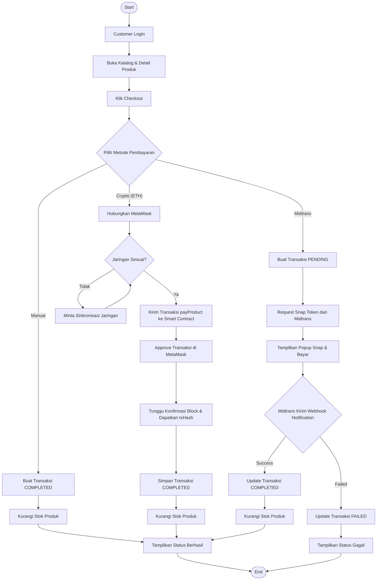
```mermaid
flowchart TD
    Start([Start]) --> Login[Customer Login]
    Login --> Browse[Buka Katalog & Detail Produk]
    Browse --> ClickCheckout[Klik Checkout]
    ClickCheckout --> ChoosePayment{"Pilih Metode Pembayaran"}
    
    ChoosePayment -- "Manual" --> ManualTx[Buat Transaksi COMPLETED]
    ChoosePayment -- "Midtrans" --> MidtransTx[Buat Transaksi PENDING]
    ChoosePayment -- "Crypto (ETH)" --> CryptoTx[Hubungkan MetaMask]
    
    %% Alur Manual
    ManualTx --> DecrStockManual[Kurangi Stok Produk]
    DecrStockManual --> ShowSuccess[Tampilkan Status Berhasil]
    
    %% Alur Midtrans
    MidtransTx --> MidtransToken[Request Snap Token dari Midtrans]
    MidtransToken --> ShowSnap[Tampilkan Popup Snap & Bayar]
    ShowSnap --> Webhook{"Midtrans Kirim Webhook Notification"}
    Webhook -- "Success" --> UpdateMidtransSuccess[Update Transaksi COMPLETED]
    Webhook -- "Failed" --> UpdateMidtransFailed[Update Transaksi FAILED]
    UpdateMidtransSuccess --> DecrStockMidtrans[Kurangi Stok Produk]
    UpdateMidtransFailed --> ShowFailed[Tampilkan Status Gagal]
    
    %% Alur Crypto
    CryptoTx --> CheckNetwork{"Jaringan Sesuai?"}
    CheckNetwork -- "Tidak" --> SwitchNetwork[Minta Sinkronisasi Jaringan]
    SwitchNetwork --> CheckNetwork
    CheckNetwork -- "Ya" --> BlockchainTx[Kirim Transaksi payProduct ke Smart Contract]
    BlockchainTx --> ApproveMetaMask[Approve Transaksi di MetaMask]
    ApproveMetaMask --> WaitReceipt[Tunggu Konfirmasi Block & Dapatkan txHash]
    WaitReceipt --> SaveCryptoTx[Simpan Transaksi COMPLETED]
    SaveCryptoTx --> DecrStockCrypto[Kurangi Stok Produk]
    
    DecrStockCrypto --> ShowSuccess
    DecrStockMidtrans --> ShowSuccess
    
    ShowSuccess --> Finish([End])
    ShowFailed --> Finish
```

---

## 10. State Diagram - Transisi Status Inquiry

Perubahan status pada data inquiry yang dikirim oleh customer dari pertama kali dibuat hingga diselesaikan oleh sales.

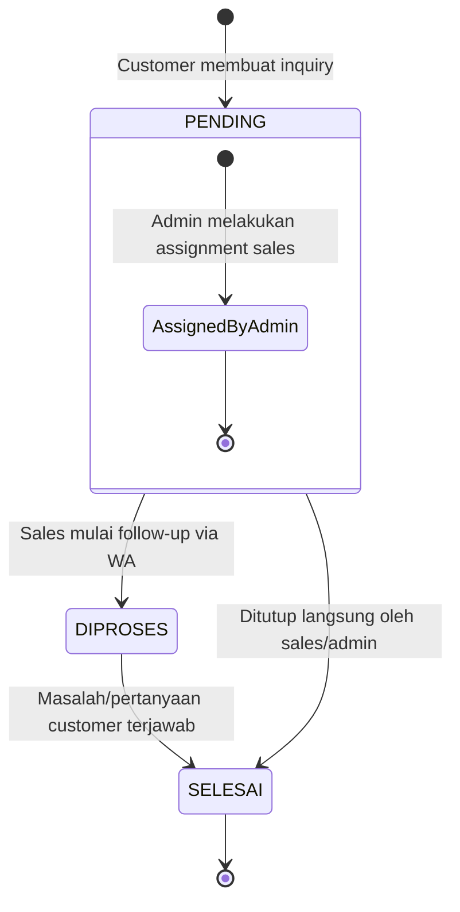
```mermaid
stateDiagram-v2
    [*] --> PENDING : Customer membuat inquiry
    
    state PENDING {
        [*] --> AssignedByAdmin : Admin melakukan assignment sales
        AssignedByAdmin --> [*]
    }
    
    PENDING --> DIPROSES : Sales mulai follow-up via WA
    DIPROSES --> SELESAI : Masalah/pertanyaan customer terjawab
    PENDING --> SELESAI : Ditutup langsung oleh sales/admin
    
    SELESAI --> [*]
```

---

## 11. State Diagram - Transisi Status Transaksi

Perubahan status pembayaran dari inisiasi awal (pending) hingga penyelesaian (completed) atau pembatalan (failed).

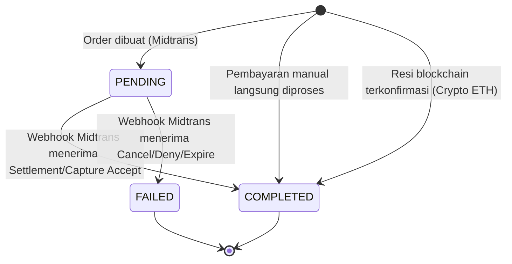
```mermaid
stateDiagram-v2
    [*] --> PENDING : Order dibuat (Midtrans)
    
    PENDING --> COMPLETED : Webhook Midtrans menerima Settlement/Capture Accept
    PENDING --> FAILED : Webhook Midtrans menerima Cancel/Deny/Expire
    
    [*] --> COMPLETED : Pembayaran manual langsung diproses
    [*] --> COMPLETED : Resi blockchain terkonfirmasi (Crypto ETH)
    
    COMPLETED --> [*]
    FAILED --> [*]
```

---

## 12. Component Diagram

Menunjukkan pembagian komponen software pada browser client, server Next.js, database, smart contract, serta API eksternal yang saling terhubung.

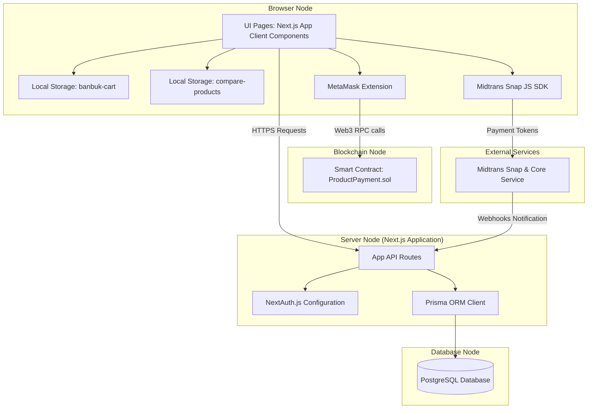
```mermaid
flowchart TB
    subgraph BrowserNode ["Browser Node"]
        UI[UI Pages: Next.js App Client Components]
        LocalCart[Local Storage: banbuk-cart]
        LocalCompare[Local Storage: compare-products]
        MetaMask[MetaMask Extension]
        SnapJS[Midtrans Snap JS SDK]
    end

    subgraph ServerNode ["Server Node (Next.js Application)"]
        AppRoutes[App API Routes]
        NextAuth[NextAuth.js Configuration]
        Prisma[Prisma ORM Client]
    end

    subgraph DatabaseNode ["Database Node"]
        DB[(PostgreSQL Database)]
    end

    subgraph BlockchainNode ["Blockchain Node"]
        SC[Smart Contract: ProductPayment.sol]
    end

    subgraph ExternalServices ["External Services"]
        MidtransGateway[Midtrans Snap & Core Service]
    end

    %% Client Interactions
    UI --> LocalCart
    UI --> LocalCompare
    UI --> MetaMask
    UI --> SnapJS

    %% Web to API Client Calls
    UI -- HTTPS Requests --> AppRoutes
    SnapJS -- Payment Tokens --> MidtransGateway
    MetaMask -- Web3 RPC calls --> SC

    %% API Interactions
    AppRoutes --> NextAuth
    AppRoutes --> Prisma

    %% Database
    Prisma --> DB

    %% External System interactions
    MidtransGateway -- Webhooks Notification --> AppRoutes
```

---

## 13. Deployment Diagram

Menunjukkan arsitektur fisik tempat software dideploy dan dijalankan, lengkap dengan protokol komunikasi antar node.

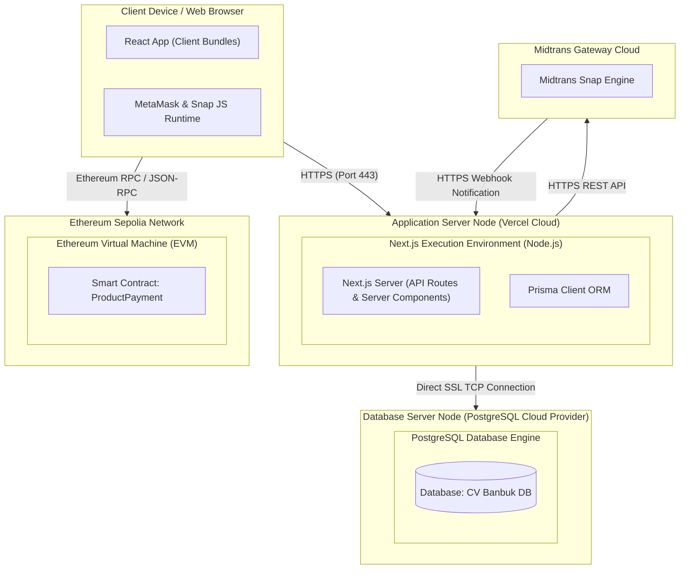
```mermaid
flowchart TB
    subgraph ClientDevice ["Client Device / Web Browser"]
        FrontendApp["React App (Client Bundles)"]
        BrowserEnv["MetaMask & Snap JS Runtime"]
    end

    subgraph VercelServer ["Application Server Node (Vercel Cloud)"]
        subgraph NextJsEE ["Next.js Execution Environment (Node.js)"]
            NextServer["Next.js Server (API Routes & Server Components)"]
            PrismaClient["Prisma Client ORM"]
        end
    end

    subgraph DBServer ["Database Server Node (PostgreSQL Cloud Provider)"]
        subgraph PostgresEE ["PostgreSQL Database Engine"]
            db[("Database: CV Banbuk DB")]
        end
    end

    subgraph MidtransCloud ["Midtrans Gateway Cloud"]
        SnapEngine["Midtrans Snap Engine"]
    end

    subgraph EthNetwork ["Ethereum Sepolia Network"]
        subgraph EVM ["Ethereum Virtual Machine (EVM)"]
            ProductPayment["Smart Contract: ProductPayment"]
        end
    end

    %% Connections
    ClientDevice -- "HTTPS (Port 443)" --> VercelServer
    VercelServer -- "Direct SSL TCP Connection" --> DBServer
    VercelServer -- "HTTPS REST API" --> MidtransCloud
    ClientDevice -- "Ethereum RPC / JSON-RPC" --> EthNetwork
    MidtransCloud -- "HTTPS Webhook Notification" --> VercelServer
```

---

## 14. Narasi dan Rekomendasi Tambahan

UML ini disusun berdasarkan spesifikasi arsitektur modular yang diimplementasikan di lapangan.

### Kelebihan Diagram Berbasis Mermaid
1. **Mencegah Kerusakan File Binary**: Berkas disimpan dalam format raw text yang bersih, sangat bersahabat dengan git tracking.
2. **Auto-Render di GitHub**: GitHub mengenali syntax block ````mermaid ... ```` dan merendernya menjadi grafik interaktif di sisi client.
3. **Mudah Diedit Ulang**: Tim pengembang lain tidak memerlukan aplikasi pihak ketiga untuk mengubah bentuk diagram; perubahan teks otomatis memetakan grafik baru.

### Catatan Keamanan Transaksi Crypto
- `ProductPayment.sol` menerima `msg.value` dalam ETH secara on-chain. Pencatatan di tabel `Transaction` hanya dilakukan setelah `receipt.status` bernilai `1` (Success).
- Integrasi wallet MetaMask sepenuhnya dijalankan pada client-side (Web3Payment) menggunakan library `ethers.js`.

### Catatan Sinkronisasi Midtrans Webhook
- Verifikasi signature key Midtrans dilakukan menggunakan format SHA512 hashing: `orderId + statusCode + grossAmount + ServerKey`. Ini mutlak diperlukan untuk mencegah fraud transaksi.

---

*Terakhir Diperbarui: 2026-06-08 - Tim Rekayasa Perangkat Lunak CV Banbuk Mandiri Jaya*
