# Dokumentasi UML Lengkap - CV Banbuk Store

Dokumen ini berisi spesifikasi UML (Unified Modeling Language) lengkap untuk sistem **CV Banbuk Store** (Virtual Product Gallery Web3). Semua diagram di bawah ini didefinisikan menggunakan format **Mermaid** sehingga dapat langsung dirender secara visual di GitHub, editor markdown modern, atau previewer Mermaid.

---

## 1. Use Case Diagram

Diagram Use Case menggambarkan interaksi antara aktor (pengguna manusia dan sistem eksternal) dengan use case (fitur) yang disediakan oleh sistem CV Banbuk Store.

```mermaid
graph TB
    subgraph Sistem CV Banbuk Store
        UC1((Register Akun))
        UC2((Login Multi-Role))
        UC3((Lihat Katalog & Detail Produk))
        UC4((Bandingkan Produk))
        UC5((Kelola Wishlist))
        UC6((Kelola Keranjang Lokal))
        UC7((Buat Inquiry Baru))
        UC8((Assign Inquiry ke Sales))
        UC9((Update Status Inquiry))
        UC10((CRUD Produk))
        UC11((Pilih Metode Pembayaran))
        UC12((Bayar via Midtrans Gateway))
        UC13((Bayar via Crypto Ethereum))
        UC14((Bayar via Manual/Simulasi))
        UC15((Lihat Dashboard & Statistik))
        UC16((Export Laporan CSV/PDF))
    end

    Admin[Aktor: Admin]
    Sales[Aktor: Sales]
    Customer[Aktor: Customer]
    Guest[Aktor: Guest]
    
    Midtrans[Sistem Eksternal: Midtrans]
    MetaMask[Sistem Eksternal: MetaMask / Web3]

    %% Hubungan Guest
    Guest --> UC3
    Guest --> UC4
    Guest --> UC6

    %% Hubungan Customer
    Customer --> UC1
    Customer --> UC2
    Customer --> UC3
    Customer --> UC4
    Customer --> UC5
    Customer --> UC6
    Customer --> UC7
    Customer --> UC11
    Customer --> UC12
    Customer --> UC13
    Customer --> UC14
    Customer --> UC15

    %% Hubungan Sales
    Sales --> UC2
    Sales --> UC3
    Sales --> UC9
    Sales --> UC15

    %% Hubungan Admin
    Admin --> UC2
    Admin --> UC3
    Admin --> UC8
    Admin --> UC10
    Admin --> UC15
    Admin --> UC16

    %% Hubungan Sistem Eksternal
    UC12 --> Midtrans
    UC13 --> MetaMask
```

### Deskripsi Aktor & Hak Akses
1. **Guest**: Pengguna yang belum login. Hanya dapat mencari, melihat, membandingkan produk, dan memasukkan produk ke keranjang lokal (`localStorage`).
2. **Customer**: Pengguna terdaftar (pembeli). Memiliki akses ke fitur transaksi (wishlist, checkout, inquiry, riwayat pembelian, pembayaran).
3. **Sales**: Staf penjualan. Bertanggung jawab memproses inquiry yang ditugaskan kepadanya, menghubungi customer via WhatsApp, dan memperbarui status inquiry.
4. **Admin**: Pengelola sistem. Bertanggung jawab mengelola produk (CRUD), memantau statistik, menugaskan inquiry ke sales, melihat user, dan mengunduh laporan.
5. **Midtrans (Sistem Eksternal)**: Gerbang pembayaran gateway untuk pemrosesan kartu/e-wallet/QRIS.
6. **MetaMask / Ethereum Network (Sistem Eksternal)**: Wallet dan blockchain network untuk pemrosesan transaksi crypto on-chain.

---

## 2. Class Diagram

Diagram kelas menunjukkan struktur statis sistem dengan mendefinisikan kelas-kelas entitas database, controller/API routes, dan integrasi eksternal beserta relasi dan operasinya.

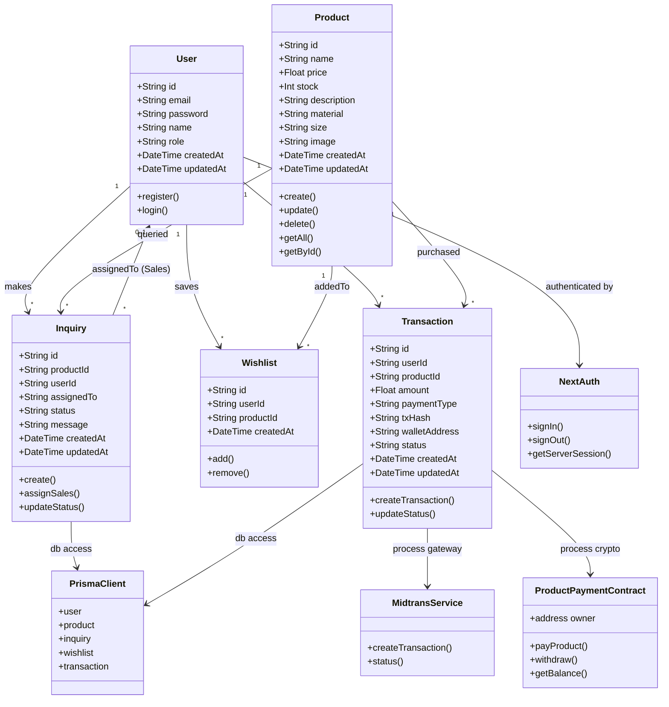

---

## 3. Sequence Diagram - Registrasi Customer

Alur registrasi akun pembeli secara mandiri melalui form publik. Pendaftaran default menghasilkan akun dengan role `CUSTOMER`.

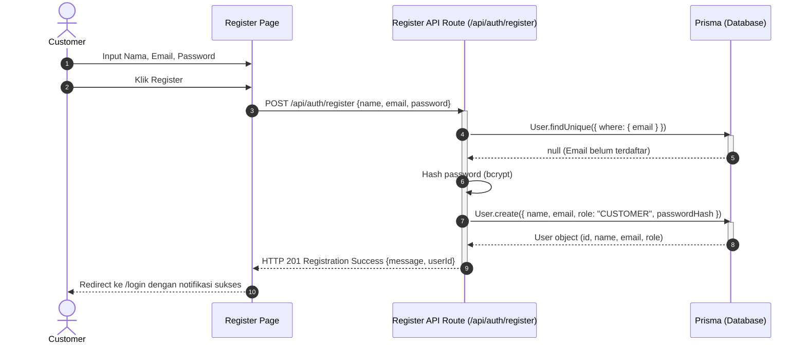

---

## 4. Sequence Diagram - Login Multi-Role

Alur masuk ke aplikasi menggunakan NextAuth dengan pencocokan kredensial yang tersimpan di database.

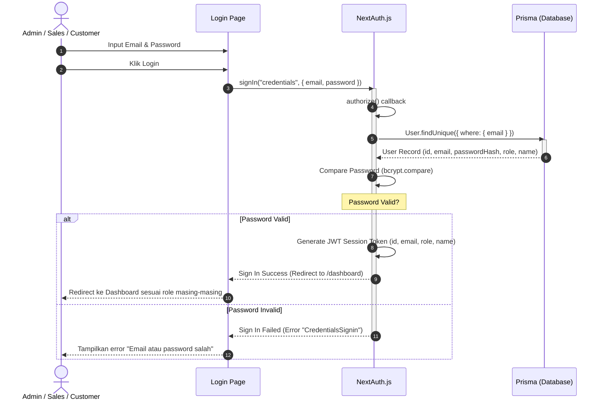

---

## 5. Sequence Diagram - Manajemen Inquiry

Proses lengkap dari pembuatan inquiry oleh customer, penugasan sales oleh admin, hingga tindak lanjut dan penutupan inquiry oleh sales.

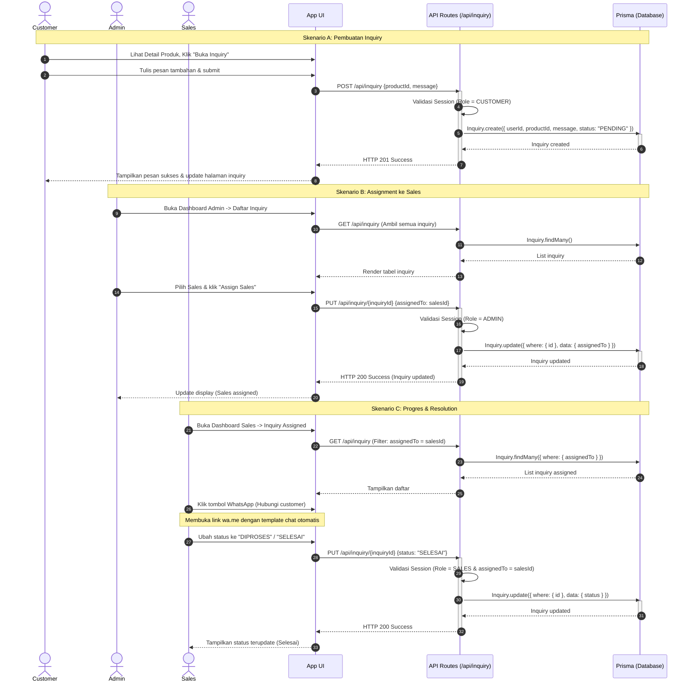

---

## 6. Sequence Diagram - Manajemen Wishlist

Proses menambahkan produk ke daftar favorit customer dan menghapusnya kembali.

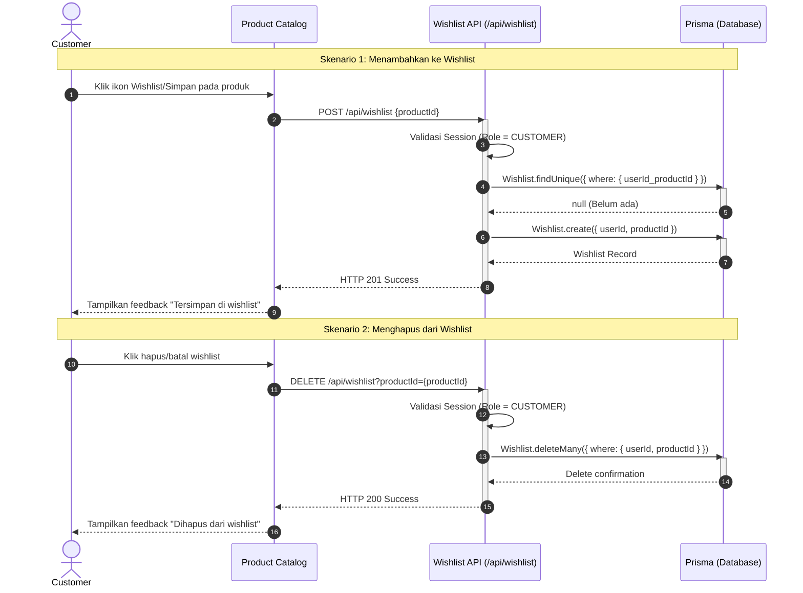

---

## 7. Sequence Diagram - Pembayaran Midtrans Gateway

Alur lengkap pembayaran produk oleh customer menggunakan gateway Midtrans Snap hingga proses callback / webhook pemberitahuan status transaksi.

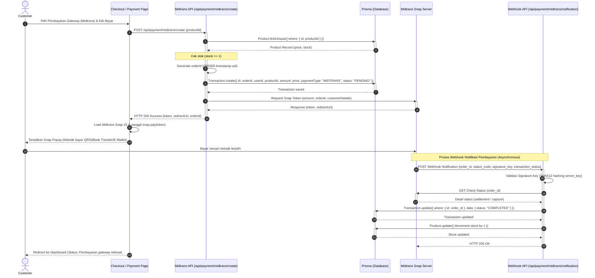

---

## 8. Sequence Diagram - Pembayaran Crypto Ethereum

Proses checkout menggunakan integrasi web3, interaksi MetaMask client-side dengan smart contract Solidity untuk pengiriman ETH, dan pencatatan on-chain.

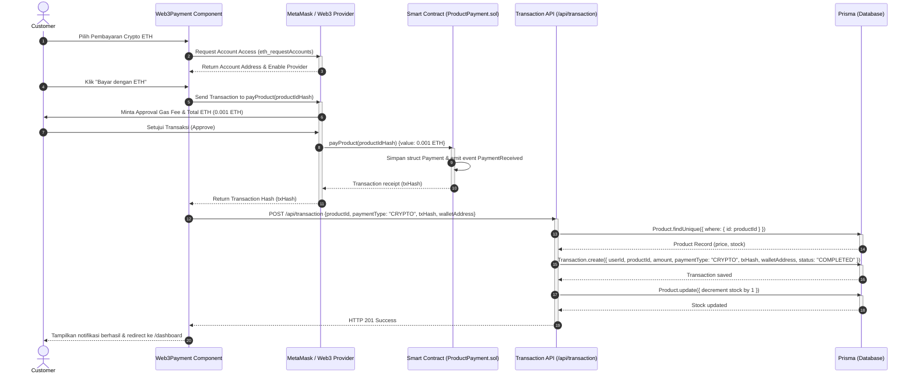

---

## 9. Activity Diagram - Pembelian & Pembayaran Produk

Aktivitas sistem secara sekuensial dan paralel dari masuknya customer, pemilihan produk, pemilihan salah satu dari 3 tipe pembayaran, hingga pencatatan transaksi dan pengurangan stok.

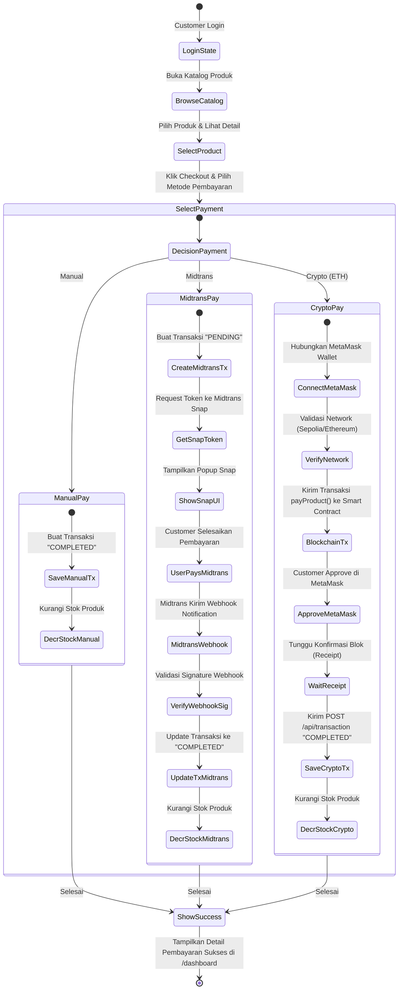

---

## 10. State Diagram - Transisi Status Inquiry

Perubahan status pada data inquiry yang dikirim oleh customer dari pertama kali dibuat hingga diselesaikan oleh sales.

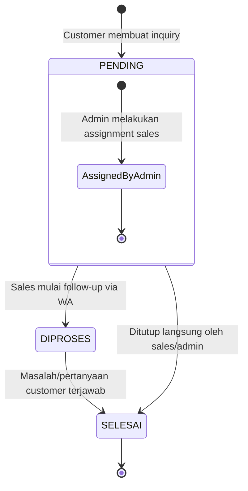

---

## 11. State Diagram - Transisi Status Transaksi

Perubahan status pembayaran dari inisiasi awal (pending) hingga penyelesaian (completed) atau pembatalan (failed).

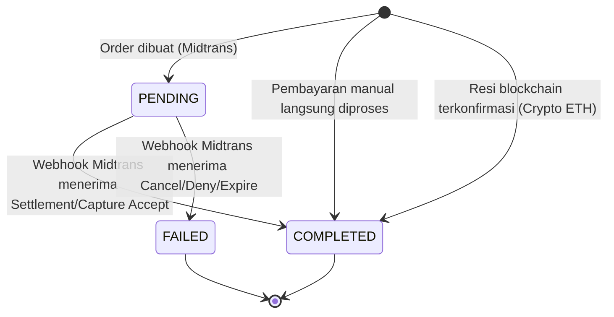

---

## 12. Component Diagram

Menunjukkan pembagian komponen software pada browser client, server Next.js, database, smart contract, serta API eksternal yang saling terhubung.

```mermaid
graph TB
    subgraph Browser Node
        UI[UI Pages: Next.js App Client Components]
        LocalCart[Local Storage: banbuk-cart]
        LocalCompare[Local Storage: compare-products]
        MetaMask[MetaMask Extension]
        SnapJS[Midtrans Snap JS SDK]
    end

    subgraph Server Node (Next.js Application)
        AppRoutes[App API Routes]
        NextAuth[NextAuth.js Configuration]
        MidtransCore[Midtrans Core API Helper]
        Prisma[Prisma ORM Client]
    end

    subgraph Database Node
        DB[(PostgreSQL Database)]
    end

    subgraph Blockchain Node
        SC[Smart Contract: ProductPayment.sol]
    end

    subgraph External Services
        MidtransGateway[Midtrans Snap & Core Service]
    end

    %% Client Interactions
    UI --> LocalCart
    UI --> LocalCompare
    UI --> MetaMask
    UI --> SnapJS

    %% Web to API Client Calls
    UI -- HTTPS Requests --> AppRoutes
    SnapJS -- Payment Tokens --> MidtransGateway
    MetaMask -- Web3 RPC calls --> SC

    %% API Interactions
    AppRoutes --> NextAuth
    AppRoutes --> MidtransCore
    AppRoutes --> Prisma

    %% Database
    Prisma --> DB

    %% External System interactions
    MidtransCore -- API Calls / Verification --> MidtransGateway
    MidtransGateway -- Webhooks Notification --> AppRoutes
```

---

## 13. Deployment Diagram

Menunjukkan arsitektur fisik tempat software dideploy dan dijalankan, lengkap dengan protokol komunikasi antar node.

```mermaid
deploymentDiagram
    node ClientDevice as "Client Device / Web Browser" {
        artifact FrontendApp as "React App (Client Bundles)"
        node BrowserEnv as "MetaMask & Snap JS Runtime"
    }

    node VercelServer as "Application Server Node (Vercel Cloud)" {
        node NextJsEE as "Next.js Execution Environment (Node.js)" {
            artifact NextServer as "Next.js Server (API Routes, Server Components)"
            artifact PrismaClient as "Prisma Client ORM"
        }
    }

    node DBServer as "Database Server Node (PostgreSQL Cloud Provider)" {
        node PostgresEE as "PostgreSQL Database Engine" {
            database db as "CV Banbuk DB"
        }
    }

    node MidtransCloud as "Midtrans Gateway Cloud" {
        node SnapEngine as "Midtrans Engine"
    }

    node EthNetwork as "Ethereum Sepolia Network" {
        node EVM as "Ethereum Virtual Machine (EVM)" {
            artifact ProductPayment as "Smart Contract (ProductPayment)"
        }
    }

    %% Network Connections
    ClientDevice -- "HTTPS" --> VercelServer
    VercelServer -- "Direct SSL TCP Connection" --> DBServer
    VercelServer -- "HTTPS REST API" --> MidtransCloud
    ClientDevice -- "Ethereum RPC JSON-RPC" --> EthNetwork
    MidtransCloud -- "HTTPS webhook" --> VercelServer
```
